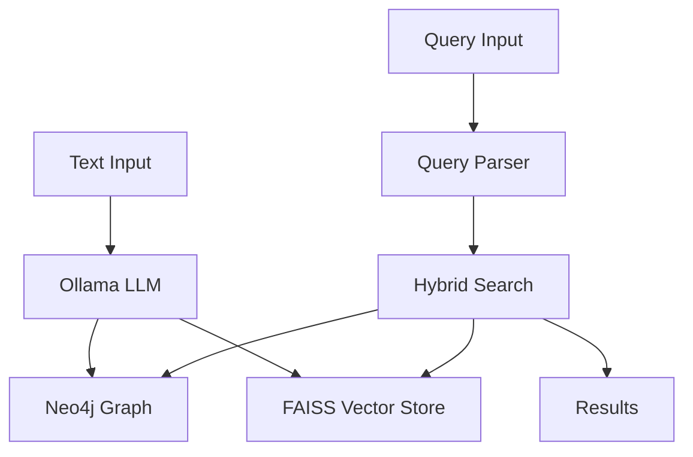

# Knowledge Graph System

A hybrid knowledge graph system integrating Neo4j for graph storage, FAISS for vector search, and LLM-based query parsing and reasoning. The system efficiently extracts, stores, retrieves, and analyzes entity relationships with a focus on causality, temporality, and semantic relevance.

See the discussion at https://www.reddit.com/r/LLMDevs/comments/1iw36cu/people_using_graphllms_how_do_you_traverse_the/

## Features

- **Graph Construction & Data Ingestion**
  - Entity and relationship extraction from unstructured text using Ollama
  - Automatic schema mapping and validation
  - Batch processing capabilities

- **Query Parsing & Intent Recognition**
  - Natural language query understanding
  - Structured constraint extraction
  - Cypher query generation

- **Hybrid Search & Retrieval**
  - Vector similarity search using FAISS
  - Graph traversal algorithms
  - Combined ranking system

- **Summarization & Validation**
  - Natural language explanations
  - Relationship validation
  - Confidence scoring

- **Dynamic Filtering & Optimization**
  - Temporal pruning
  - Dynamic edge weighting
  - Query optimization

## Architecture



## Prerequisites

1. Install Ollama:
```bash
# macOS/Linux
curl https://ollama.ai/install.sh | sh

# Windows
# Download from https://ollama.ai/download
```

2. Pull required models:
```bash
# Main LLM for extraction and query parsing
ollama pull llama2

# Embedding model for vector search
ollama pull nomic-embed-text
```

3. Start Ollama server:
```bash
ollama serve
```

## Installation

1. Clone the repository:
```bash
git clone https://github.com/yourusername/knowledge-graph.git
cd knowledge-graph
```

2. Install dependencies using Poetry:
```bash
poetry install
```

3. Set up environment variables:
```bash
cp .env.example .env
# Edit .env with your configuration
```

4. Install and start Neo4j:

```bash
# Using Docker
docker run \
    --name neo4j \
    -p 7474:7474 -p 7687:7687 \
    -e NEO4J_AUTH=neo4j/your_password \
    neo4j:latest
```

Add GDS plugin https://github.com/neo4j/graph-data-science/releases to folder plugins/

CALL gds.version()
CALL gds.graph.project('graph','*','*')

## Usage

### Data Ingestion

Use the provided ingestion script to populate the knowledge graph:

```bash
python examples/ingest_data.py
```

Example code for custom ingestion:

```python
from knowledge_graph.extraction import LLMExtractor
from knowledge_graph.schema import SchemaManager

# Initialize components
extractor = LLMExtractor(
    model_name="llama2",  # Ollama model to use
    base_url="http://localhost:11434"  # Ollama API endpoint
)
schema_manager = SchemaManager(uri, username, password)

# Extract and store knowledge
result = extractor.extract(text)
for entity in result.entities:
    node_id = schema_manager.create_node(
        label=entity["type"],
        properties=entity
    )
```

### Querying

Use natural language queries to search the knowledge graph:

```python
from knowledge_graph.query import QueryParser
from knowledge_graph.search import HybridSearchEngine

# Initialize components
parser = QueryParser(
    model_name="llama2",
    base_url="http://localhost:11434"
)
search_engine = HybridSearchEngine(...)

# Execute query
query = "What contributions did Alan Turing make during World War II?"
constraints = parser.parse_query(query)
results = search_engine.search(query_embedding, params=constraints)
```

### API Usage

Start the FastAPI server:

```bash
poetry run uvicorn knowledge_graph.api.main:app --reload
```

Example API requests:

```bash
# Extract entities from text
curl -X POST "http://localhost:8000/extract" \
    -H "Content-Type: application/json" \
    -d '{"text": "Your text here"}'

# Execute a query
curl -X POST "http://localhost:8000/query" \
    -H "Content-Type: application/json" \
    -d '{"query": "Your query here"}'
```

## Development

- Run tests: `poetry run pytest`
- Format code: `poetry run black .`
- Type checking: `poetry run mypy .`

## Project Structure

```
knowledge_graph/
├── schema/           # Neo4j schema definitions
├── extraction/       # Entity extraction module
├── query/           # Query parsing and execution
├── search/          # Hybrid search implementation
├── api/             # FastAPI service
└── utils/           # Shared utilities
```

## Configuration

Key configuration options in `.env`:

```ini
# Neo4j Configuration
NEO4J_URI=bolt://localhost:7687
NEO4J_USER=neo4j
NEO4J_PASSWORD=your_password

# Ollama Configuration
OLLAMA_BASE_URL=http://localhost:11434
OLLAMA_MODEL=llama2
OLLAMA_EMBEDDING_MODEL=nomic-embed-text

# Vector Store Configuration
VECTOR_STORE_PATH=./vector_store
EMBEDDING_DIM=768  # nomic-embed-text dimension
```

## Available Models

The system is configured to use the following Ollama models by default:

- **llama2**: Main language model for entity extraction and query parsing
- **nomic-embed-text**: Embedding model for vector search (768-dimensional embeddings)

You can experiment with other Ollama models by modifying the configuration:

```bash
# List available models
ollama list

# Pull additional models
ollama pull mistral
ollama pull codellama
```

Then update your `.env` file to use a different model:

```ini
OLLAMA_MODEL=mistral
```

## Contributing

1. Fork the repository
2. Create a feature branch
3. Commit your changes
4. Push to the branch
5. Create a Pull Request

## License

This project is licensed under the MIT License - see the LICENSE file for details.
